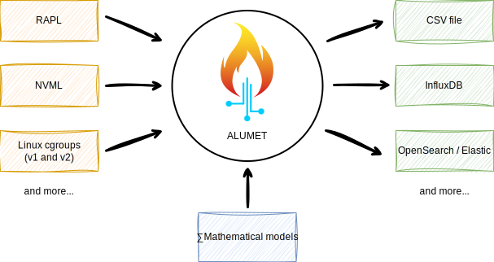

# Introduction

Welcome to the Alumet user guide!
If you want to measure something with Alumet, you have come to the right place.

To skip the introduction and install Alumet, [click here](start/install.md).

## What is Alumet?

Alumet is a modular framework for local and distributed measurement.

Alumet provides a unified interface for gathering measurements with sources (on the left), transforming the data with models (in the middle) and writing the result to various outputs (on the right).
The elements (colored rectangles) are created by plugins, on top of a standard framework.

Key points:
- The framework is **generic and extensible**: you can write your own plugins if you need to, or take what you need among the numerous existing plugins. Alumet can easily be extended in order to make new research experiments: add new probes, statistical models, transform functions, export formats, etc. using a high-level API.
- Alumet is **efficient**: written in Rust and optimized for low-latency measurement. (scientific publication pending with benchmarks)
- Alumet is **more correct** than some existing "software powermeters": our plugins fix some bugs that are hard to detect[^rapl_paper].
- It produces good **operational tools**: the end result is (or aims to be) a ready-to-use measurement tool that is robust, efficient and scalable.
- You **have control** over the tool: the methodology is transparent, the configuration is clear, and you are free to change whatever you want.

Please read the [developer book](https://alumet-dev.github.io/developer-book/) to learn more about the creation of plugins.

[^rapl_paper]: Guillaume Raffin, Denis Trystram. Dissecting the software-based measurement of CPU energy consumption: a comparative analysis. 2024. ⟨hal-04420527v2⟩.

### What makes Alumet more efficient?

The _L_ in Alumet stands for _Lightweight_. Why is Alumet "lightweight" compared to other measurement tools?

1. **Optimized pipeline**: Alumet is written in Rust, optimized for minimal latency and low memory consumption.
2. **Efficient interfaces**: When we develop a new measurement source, we try to find the most efficient way of measuring what we're interested in. As a result, many plugins are based on low-level interfaces, such as the Linux [perf_events interface](https://man.archlinux.org/man/perf_event_open.2.fr), instead of slower higher-level wrappers. In particular, we try to remove useless intermediate levels, such as calling an external program and parsing its text output.
3. **Pay only for what you need**: Alumet's modularity allows you to create a bespoke measurement tool by choosing the plugins that suit your needs, and removing the rest. You don't need a mathematical model that assigns the energy consumption of hardware components to processes? Remove it, and enjoy an even smaller disk footprint, CPU overhead, memory use and energy consumption.

## Does it work on my machine ?

<!-- TODO make a separate page "compatibility table" -->
For now, Alumet works in the following environments:

- Operating Systems: Linux, ~~macOS[^os], Windows[^os]~~
- Hardware components[^component]:
  - CPUs: Intel x86 processors (Sandy Bridge or more recent), AMD x86 processors (Zen 1 or more recent), NVIDIA Jetson CPUs (any model)
  - GPUs: NVIDIA dedicated GPUs, NVIDIA Jetson GPUs (any model)

(nice compatibility table coming soon)

[^os]: While the core of Alumet is cross-platform, many plugins only work on Linux, for example the RAPL and perf plugins. There is no macOS-specific nor Windows-specific plugin for the moment, so Alumet will not be able to measure interesting metrics on these systems.

[^component]: If your computer contains both supported and unsupported components, you can still use Alumet (with the plugins corresponding to the supported components). It will simply not measure the unsupported components.
