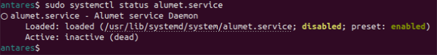
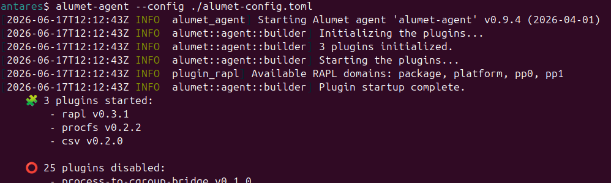
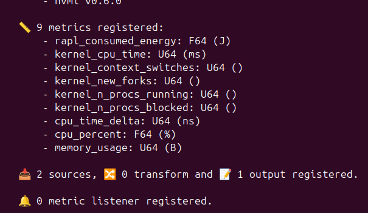

# Monitoring an entire system

In this tutorial, you will learn how to install Alumet to monitor your system through an easy step-by-step guide.

## Install Alumet

There are several ways of installing Alumet, you can use packages such as *.rpm* or *.deb*, you can install it using container image, there's even a helm chart. But for now, let's focus on package way using the installer provided in the [Alumet repository](https://github.com/alumet-dev/alumet).

```bash
curl -sSL https://raw.githubusercontent.com/alumet-dev/alumet/main/install.sh | bash
```

if you don't trust us (and you're right)

```bash
curl -sSL https://raw.githubusercontent.com/alumet-dev/alumet/main/install.sh -o install.sh
chmod +x install.sh
./install.sh
```

Your password could be asked.

### important files

Once installed, let's take a quick look at the files.
The configuration file of alumet could be found under:
**/etc/alumet/alumet-config.toml**, you could add all needed plugins and their configuration.

On installation, Alumet add a systemd service.


As you can see, the service is not enabled and not running. So Alumet is not running for now.

## Prepare the configuration

For now, we want to monitor our system, so let's focus on basic plugin
- Input plugins
  - RAPL
  - Procfs (system)
- Output plugins
  - CSV

According to the above list, here is the associated configuration file for Alumet. You can add the following content to a file: **./alumet-config. toml**.

```toml
[plugins.rapl]
poll_interval = "5s"
flush_interval = "10s"
no_perf_events = false

[plugins.procfs.kernel]
enabled = true
poll_interval = "5s"

[plugins.procfs.memory]
enabled = false
poll_interval = "5s"
metrics = [
    "MemTotal",
    "MemFree",
    "MemAvailable",
    "Cached",
    "SwapCached",
    "Active",
    "Inactive",
    "Mapped",
]

[plugins.procfs.network]
enabled = false
poll_interval = "5s"

[plugins.procfs.processes]
enabled = true
refresh_interval = "2s"
strategy = "watcher"

[[plugins.procfs.processes.groups]]
exe_regex = ""
poll_interval = "2s"
flush_interval = "4s"
memory_mode = "quick"

[plugins.procfs.processes.events]
poll_interval = "1s"
flush_interval = "4s"
memory_mode = "quick"

[plugins.csv]
output_path = "alumet-output.csv"
force_flush = true
append_unit_to_metric_name = true
use_unit_display_name = true
csv_delimiter = ";"
csv_late_delimiter = ","
```

## Run Alumet

Once your configuration is done, it's time to run Alumet. Several ways appears. We can use the systemd to make the measurements in background, and so use:
to start Alumet

```bash
sudo systemctl start alumet.service
```

and to stop measurements

```bash
sudo systemctl stop alumet.service
```

But here, for more demonstrative try, I will directly launch it through CLI.
To start Alumet on this way, use

```bash
alumet-agent --config ./alumet-config.toml
```

Please not that I used the flag **config** with the path of previously defined Alumet config to use it.

On my side, here is the launch of Alumet.



to



Here you can see that I enabled 3 plugins, 2 were input one and 1 is output.

Hit `ctrl+c` to stop Alumet and the measures.

## Look for the results

Once Alumet is stop, you can have a look to the created file in current repository: **alumet-output.csv**. The name and path was defined in the configuration file. You can search for **output_path** parameter in the **alumet-config.toml** of the current directory.
And so you have your csv file containing all retrieved measures. You can freely use whatever you want to read this csv, basic file editor will be able to open it, but some will let you sort, filter,... contained lines.
