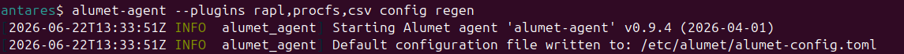
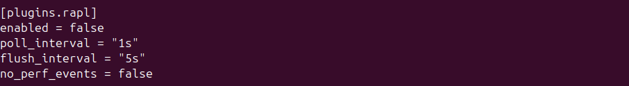
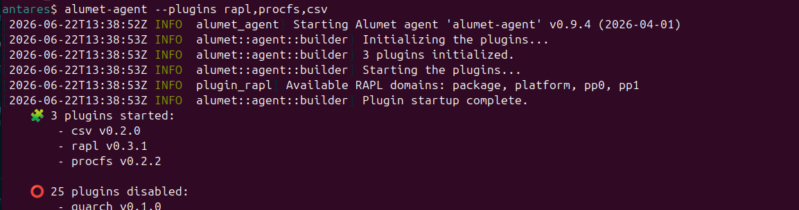
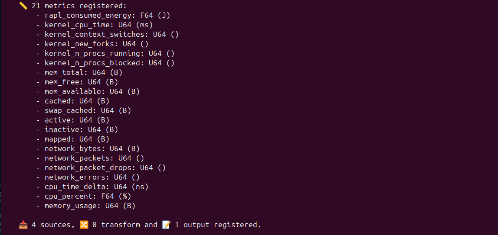

# Monitoring an entire system

In this tutorial, you will learn how to install Alumet to monitor your system through an easy step-by-step guide.

## Install Alumet

There are several ways of installing Alumet, you can use packages such as *.rpm* or *.deb*, you can install it using container image, there's even a helm chart. But for now, let's focus on package way using the installer provided in the [Alumet repository](https://github.com/alumet-dev/alumet).

```bash
curl -sSL https://raw.githubusercontent.com/alumet-dev/alumet/main/install.sh | bash
```

Your password could be asked.

See more on [Installing Alumet](../start/install.md) chapter.

### Important files

Once installed, let's take a quick look at the files.
The configuration file of alumet can be found under:
**/etc/alumet/alumet-config.toml**, you could add all needed plugins and their configuration.

On installation, Alumet add a systemd service.


As you can see, the service is not enabled and not running. So Alumet is not running for now.

## Prepare the Configuration

In this tutorial, we will monitor our system. So let's focus on the following plugins:
- Input plugins
  - RAPL
  - Procfs (system)
- Output plugins
  - CSV

### RAPL

This plugin collects measurements of processor energy usage. Also know as `Running average power limit`, follow the link to learn more on [RAPL](https://en.wikipedia.org/wiki/Perf_(Linux)#RAPL).

### Procfs

This plugin collects processes and system-related metrics on Linux based operating systems. Follow the link to learn more on [Procfs](https://en.wikipedia.org/wiki/Procfs).

### CSV

This plugin writes the measurements sent to Alumet in [CSV format](https://en.wikipedia.org/wiki/Comma-separated_values).

### The configuration

Alumet comes with a command to regenerate the configuration. Let's do this for the used plugins using:

```bash
alumet-agent --plugins rapl,procfs,csv config regen
```



If you want, you can disable some plugin, going under the config file and replacing (or adding):
**enabled = false** wherever you want to disable the plugin.
Like this:


Also, you can use the following configuration for a easy-start Alumet monitoring.

<details>
<summary>Show more</summary>

```toml
[plugins.rapl]
poll_interval = "5s"
flush_interval = "10s"
no_perf_events = false

[plugins.procfs.kernel]
enabled = true
poll_interval = "5s"

[plugins.procfs.memory]
enabled = false
poll_interval = "5s"
metrics = [
    "MemTotal",
    "MemFree",
    "MemAvailable",
    "Cached",
    "SwapCached",
    "Active",
    "Inactive",
    "Mapped",
]

[plugins.procfs.network]
enabled = false
poll_interval = "5s"

[plugins.procfs.processes]
enabled = true
refresh_interval = "2s"
strategy = "watcher"

[[plugins.procfs.processes.groups]]
exe_regex = ""
poll_interval = "2s"
flush_interval = "4s"
memory_mode = "quick"

[plugins.procfs.processes.events]
poll_interval = "1s"
flush_interval = "4s"
memory_mode = "quick"

[plugins.csv]
output_path = "alumet-output.csv"
force_flush = true
append_unit_to_metric_name = true
use_unit_display_name = true
csv_delimiter = ";"
csv_late_delimiter = ","
```

</details>

Learn more about configuration file on the [Configuration file](../start/config.md) chapter.

## Run Alumet

Once your configuration is done, it's time to run Alumet.

To start Alumet, use

```bash
alumet-agent --plugins rapl,procfs,csv
```

On my side, here is the launch of Alumet.



to



Here you can see that I enabled 3 plugins, 2 were input one and 1 is output.

Hit `ctrl+c` to stop Alumet and the measures.

## Look for the results

Once Alumet is stopped, you can have a look to the created file in current directory: **alumet-output.csv**. The name and path were defined in the configuration file. You can search for **output_path** parameter in the **alumet-config.toml** of the current directory.
And so you have your csv file containing all retrieved measures. You can freely use whatever you want to read this csv, basic file editor will be able to open it, but some will let you sort, filter,... contained lines.

## Learn more

CSV is a very simple output but it could not be adapted for larger data gathering. You could look at the [Influxdb plugins](../plugins/3_outputs/influxdb.md) for a better adapted plugin.

And for a deeper tutorial, please have a look at the [Deeper system monitoring with Alumet](deeper-system-monitoring-tutorial.md) chapter, which show more options for monitoring your system.
